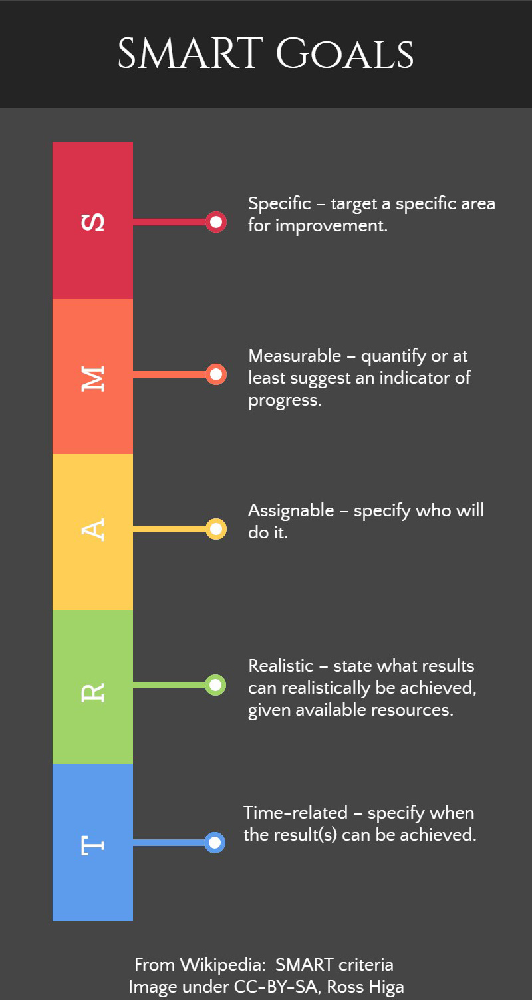

Have you ever heard of [SMART goals](https://en.wikipedia.org/wiki/SMART_criteria)? SMART is a way to create goals and tasks that allow for work distribution and measured success in teams of people.



The reason I ask is because while I have no doubt you are smart, your goals may not be. The some of the same principles used for SMART goals can affect if people will help you and respond to questions you ask.

Specific issue questions with specific information about your environment are much more likely to get a response on public forums or mailing list. Asking questions that are targeted to a particular outcome will help you achieve that outcome. Broad questions and providing personal interjection for context information can leave readers either puzzled to the real issue or lead them down the wrong path due to bad information.

For example let’s deconstruct [this Stack Overflow question](hhttps://stackoverflow.com/questions/42619312/switch-php-versions-on-commandline-ubuntu-16-04) about php version copied below. 

salimsaid writes in Switch php versions on commandline ubuntu 16.04:
<blockquote>
I have installed php 5.6 and and php 7.1 on my Ubuntu 16.04

I know with Apache as my web server, I can do
```
a2enmod php5.6 #to enable php5
a2enmod php7.1 #to enable php7
```
When I disable php7.1 in Apache modules and enable php 5.6, Apache recognizes the change and uses php 5.6 interpreter as expected.

But when I run internal php web server from the commandline:
```
php -S localhost:8888
```
php handles requests using php 7, how do I switch between php 6.6 and php 7.1 in the commandline ?
</blockquote>

You might not even have heard of PHP but that doesn't mean the post is unclear. The title is a great question that states the version number of his OS, Ubuntu 16.04. salimsaid then mentions that they have found information or know how to execute the outcome on their web server Apache, but are looking to do the same for their shell. 

Now all of the answer are targeted for Ubuntu. Using "update-alternatives --config php" will change the configuration on Ubuntu. If salimsaid never mentioned the version or type of his operating system it would be very hard to give the correct instructions. For example on CentOS, the procedure is to use the [alternatives](https://linux.die.net/man/8/alternatives) command.

Let’s be realistic here and understand that nobody is going to read your mind. Let's take a look at this post that Phuc LK wrote that could learn from salimsaid.
Phuc LK [posted](https://stackoverflow.com/questions/57919699/how-to-update-my-web-application-into-sever-and-test-the-first-demo):
<blockquote>
i'm try update my web application to server and it not work. My web start with a file java servlet...
</blockquote>

This post got a negative score and it's very clear why. The asker hasn't asked the question in a smart way. The reader would have no idea of web application server type, commands to start the applet, or even which version of Java and OS this person has. There needs to be major clarification and restating of the question to be more specific before it's realistic someone will answer. 

Further reading: [How to Ask Question the Smart Way](http://www.catb.org/esr/faqs/smart-questions.html)
