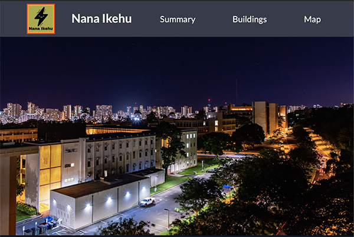
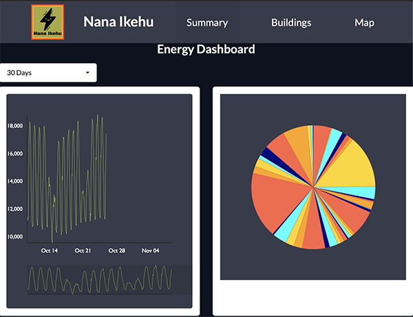
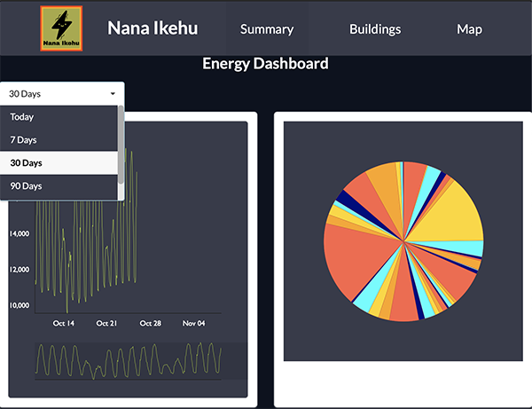
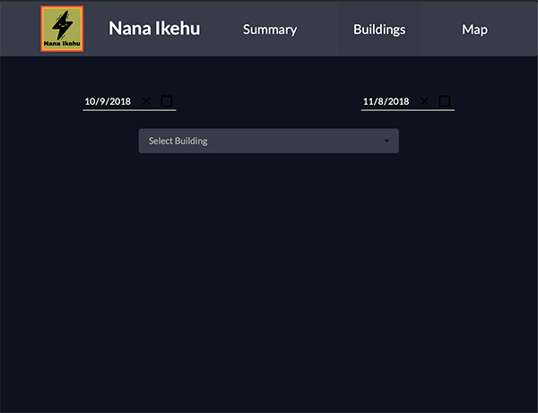
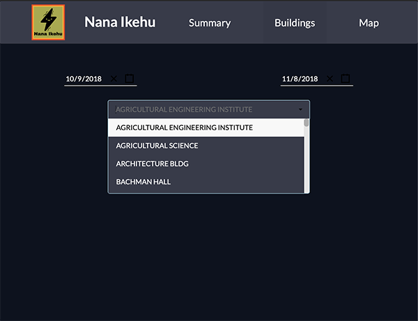
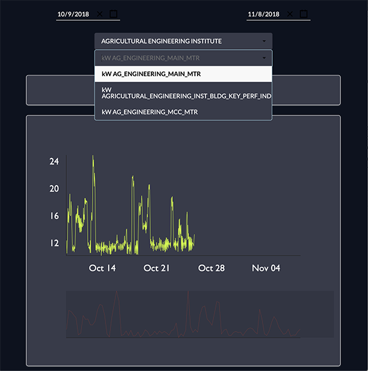
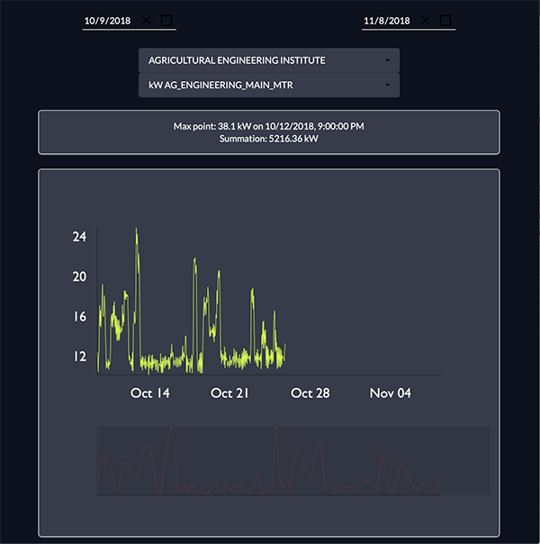
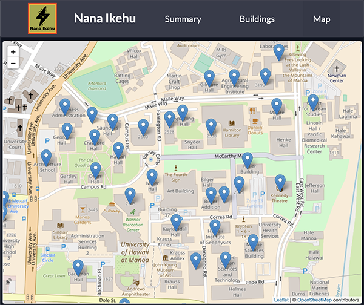
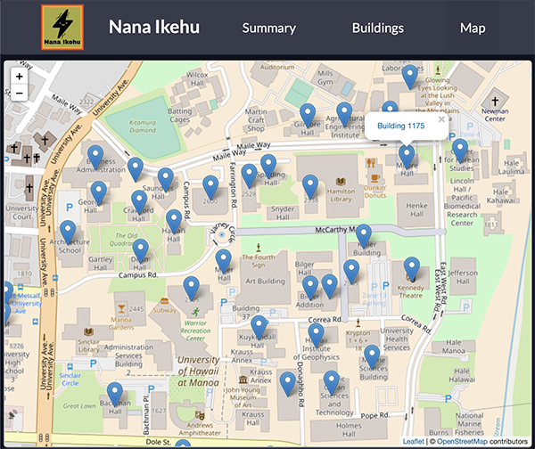
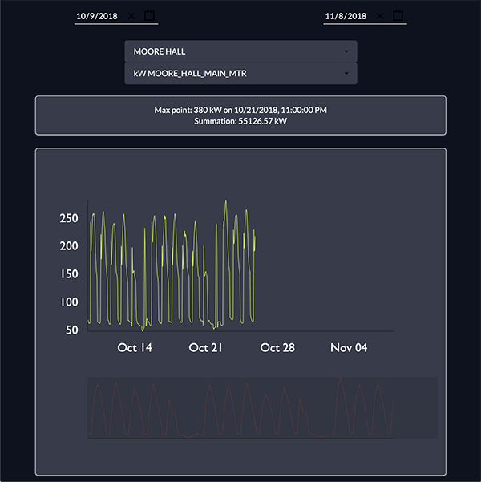

* [About Nānā Ikehu](#about-nanaikehu)
  * [What it does](#what-it-does)
  * [Configuration](#configuration)
    * [export.csv - Raw data](#export.csv-raw-data)
    * [BuildingList.csv - Building configuration](#building-configuration)
    * [TagIds.csv - Meter configuration](#meter-configuration)
  * [Deployment](#deployment)
  * [How we built it](#how-we-built-it)
  * [Challenges we ran into](#challenges)
  * [What we learned](#what-we-learned)
  * [Accomplishments that we're proud of and todo](#accomplishments)
  * [Mahalo](#mahalo)
    * [HAAC Sponsors](#sponsors)
    

# About Nana Ikehu 

Nānā Ikehu
> Nānā: To see, observe, or inspect
> Ikehu: Power, intensity, or energy

Welcome to Nānā Ikehu (Seeing Power) [Meteor/React application](http://ics-software-engineering.github.io/meteor-application-template-react/) to analyze power usage data, designed for the [University of Hawaii at Manoa](https://manoa.hawaii.edu/) as part of the [Hawaii Annual Code Challenge 2018](http://hacc.hawaii.gov/)

## What it does
This app visualizes energy usage throughout the University of Hawaii campus through the use of graphs and maps.  Users are able to see the amount of energy used for each building by either clicking a building on the campus map, or by selecting a building through the drop down menu.

When you come to the site, you are greeted by the following landing page:

The first tab will be summary:
 

 
The summary has a dropdown with the range to select:

  
The second tab will be buildings:

The building has two dropdowns, the first dropdown is the selection of buildings:

The second dropdown is the selection of meter ID:

when we selected building and meter ID a graph will be render:

The third tab will be map:

When selecting a building on the map,a pop up will appear with a link to building tab:

When the link is clicked, it will switch to the building tab with the selected building ID. The graph will show the data of the seleted building:

## Configuration

Raw database files from Aurora BPA MS-SQL can be exported to CSV for import into this application. Three files must be placed in `app/private/files` before deploying.

### export.csv - Raw data
`SampleTsUtc` is a timestamp, we do our best to parse any given format
`TagLogId` matches a meter tag
`Mean` is the main measurement used for display
`Min` is used to calculate least demand
`Max` is used to calculate peak demand

This file can be automatically generated using Aurora BPA MS-SQL with this sample query:

`SELECT SampleTsUtc,LogHour.TagLogId
      ,Mean
      ,Min
      ,Max
  FROM [LogHour]
  JOIN LogHourExtension on LogHour.TagLogId = LogHourExtension.TagLogId AND
  LogHour.DayId = LogHourExtension.DayId AND
  LogHour.TimeId = LogHourExtension.TimeId
  JOIN tags.dbo.[TagIds] on LogHour.TagLogId = [TagIds].TagLogId
  where (TagName = 'kw') and Quality = 1;`

This query will select needed header fields, reconcile DayId and TimeId values from the Extension table, then filter out high quality power data

### BuildingList.csv - Building configuration
Column 1 supplies a unique tag or identifier for a building
Column 2 is a friendly name for a building
Columns 3,4,5 supply gross square footage, floor count, and room count for the building
### TagIds.csv - Meter configuration
`BuildingName` is a column that matches a building Name
`EntityName` is a column that supplies a name for a meter
`TagLogId` is a column that matches the a meter's tag in the raw data
`TagName` contains that meter's unit of measurement

## Deployment

If you are not familiar with Meteor it is recommended that you [Galaxy or mup](https://guide.meteor.com/deployment.html#galaxy) to deploy this application.

## How we built it
The technologies used include:
* Meteor.js
* React.js
* Semantic-UI
* Victory (Graphs)

## Challenges we ran into
During the HACC, we ran into many challenges.  It was difficult finding a way to handle such a large amount of data for our app without slowing it down.  We also ran into problems with scheduling and role assignments.  Due to time constraints and our members busy schedules, we were not able to work on our app as much as we wanted to.

## What we learned
This Hackathon demanded of us (in a good way) to build a project portfolio and most importantly, it gives an opportunity for us to learn new experiences with our team. We've also learned how to manage our time since the duration of the hackathon is in a very short term, this way actually encouraging us to work with the most productive and efficient method because of limited time.

## Accomplishments that we're proud of and todo
As a team, we are proud of the fact that our application works the way we want to. We see value in providing tighter integration with other data sources and plan to add REST APIs. These APIs will allow other teams to get data from our application transparently as well as allow users to import data in real time using HTTP. We also would like to develop more historical tracking and metrics to further insights.

## Mahalo 
Special thanks to: 

Miles Topping, Director of Energy Management at University of Hawaii for providing us gigabytes of data and resources for this challenge

[Dr.-Ing. Darren Carlson](http://ee.hawaii.edu/faculty/detail.php?usr=87), Professor of Computer Engineering for providing beefy computer and space resources 

[UH Manoa ICS Department](http://ics-software-engineering.github.io/meteor-application-template-react/)  for supplying the inital template for Meteor and React

[Formidable Labs](https://formidable.com/open-source/) for supplying the Victory graphing engine

[Papa Parse](https://www.papaparse.com/) for the powerful, in-browser CSV parser for big data

### HAAC Sponsors: 
[Bill and Melinda Gates Foundation](https://www.gatesfoundation.org/)

[Hawaii Department of Agriculture](http://hdoa.hawaii.gov/)

[Kaiser Permanente](https://thrive.kaiserpermanente.org/)

[Transform Hawaii Government](http://transformhawaiigov.org/)

[DataHouse](http://www.datahouse.com/)

[Pacxa](http://www.pacxa.com/)

[Salesforce](https://www.salesforce.com/)

[Unisys](https://www.unisys.com/)

### Role:

In this project, I was a lead programmer who was responsible for programming the PhoneGap app using angular.js and Ionic to create a iOS and Android app using a single code base. JavaScript and HTML are combined in Ionic along with the INA219 High Side DC Current Sensor Breakout on our Arduino. I was able to gather current and voltage output rates on a Arduino and feed the power data using an ethernet shield into a simple PHP script which ingested the data to a MySQL table I setup. MySQL processed and averaged charging rates to display to the end user on their smartphone.

I also made contributions to logic chip selection and was the main designer and integrator of the lead acid battery charging logic which used the TI TPS5420 and TI UC3906N. I implemented the resistor feedback network, from the datasheets, needed to accommodate our charge rates.  

We suffered many set backs, mostly with the physical aspect of the project. Most notable is that we broke our solar panel mounting base while transporting it to the final showcase. All of us learned valuable lessons in ball bearings, epoxy, part selection, ordering, and of course failure. We did not size the solar panel correctly the first go an ended up with a beast, a 50W polycrystalline 2 foot square panel, which we then had to use and kicked off several redesigns. For someone more adept at the keyboard, I thank my fellow partners for the sleepless nights wondering how we can rotate and push a 4 pound beast with a tiny Arduino.

#### Further Reading:

You can learn more at the [UH EE Department](http://ee.hawaii.edu)
   
Forked with permission of [team member](https://github.com/icarus0/unjammy.github.io/blob/master/projects/solarbeast.md)
