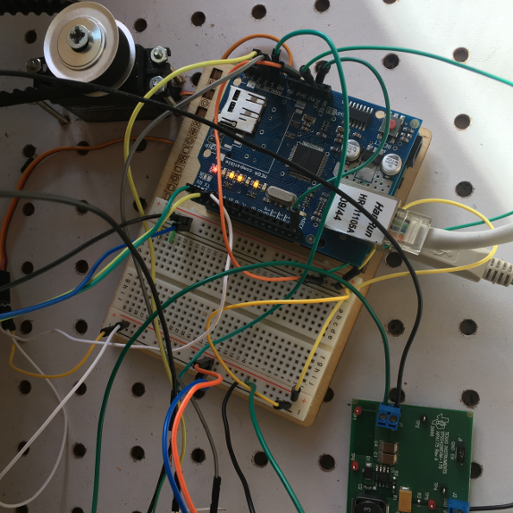

  

### Scope:

Embedded System Design challenged us to use the popular Arduino microcontroller to build an innovative new product.  
The project culminated with a sales pitch presentation at the end of the semester.  Many of the teams created intersting
 prodcuts that pushed the limits of what is possible with just an Arduino. 
 The motivation behind our project was to develop a cheap, peripheral system that can improve the power quality of 
 solar arrays.  In particular, one way to improve power quality is to include a magnification lens transposed over the 
 solar panel, the drawback, however, is angle of incidence must be nearly perfect for the power quality to improve.  
 Our system set to solve this problem using Log-Scale Analog Light Sensors, 180-degree Servo, and 3200-N Linear 
 Actuator in conjunction with our Arduino.  Although initially designed as a theoretically addition to a magnified 
 solar array, the system was capable of maintaing a 14V floating charge on a lead-acid powerbank, and led to data that 
 supports a 13% increase in energy collection on traditional solar panels.

### Role:

In this project, I was a lead programmer who was responsible for programming the PhoneGap app using angular.js and Ionic. 
I also made contributions to IC selection and was the main designer and integrator of the TI TPS5420 and 
TI UC3906N lead acid charging logic.  Using the INA219 High Side DC Current Sensor Breakout I was able to gather statistics on Arduino and feed 
the power dzta into a MySQL backend which fed our phone app logic and numerical analysis.

#### Further Reading:

You can learn more at the [UH EE Department](http://ee.hawaii.edu)
   
Forked with permission of [team member](https://github.com/icarus0/unjammy.github.io/blob/master/projects/solarbeast.md0.)